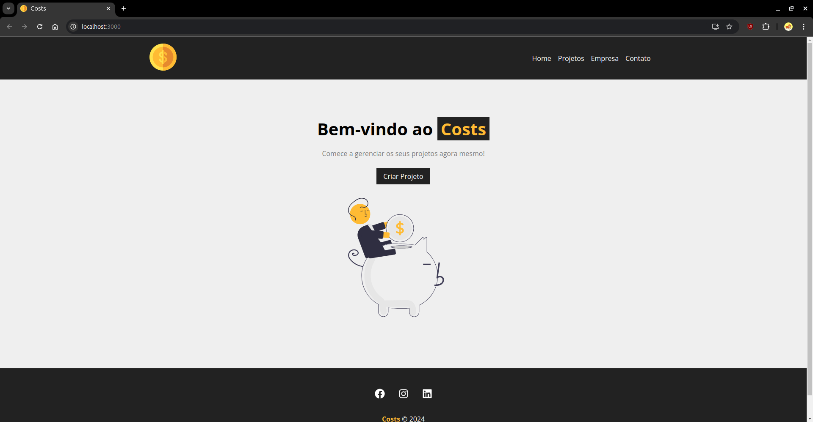
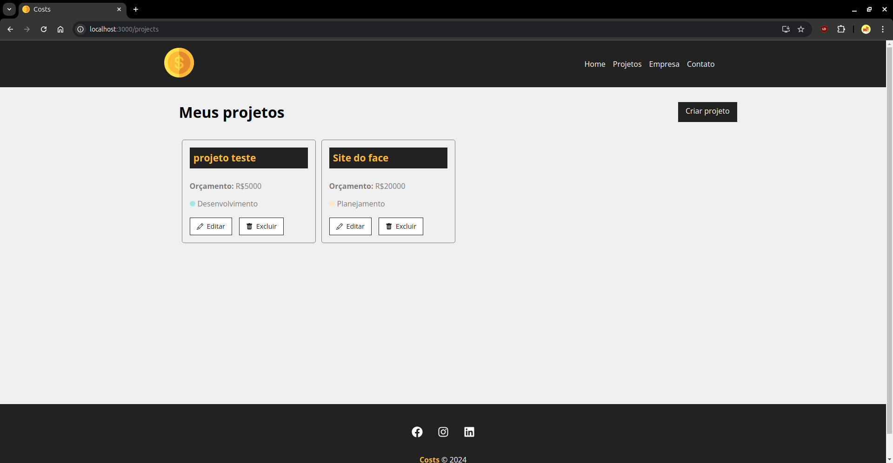
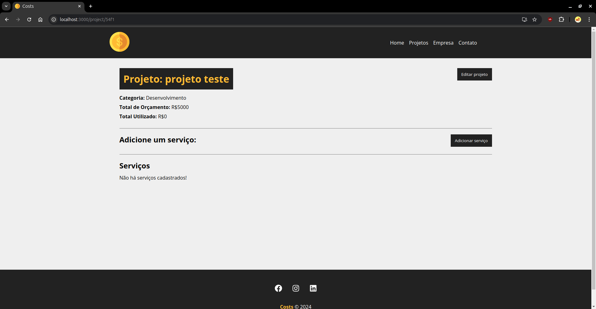
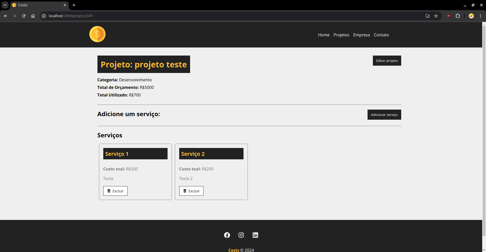

# Costs

Este é um projeto em React desenvolvido para gerenciar custos de projetos de desenvolvimento e serviços contratados para cada um. Ele utiliza o `json-server` para fornecer uma API simulada de backend para testes e desenvolvimento local.

## Tecnologias Utilizadas

- **React**: Biblioteca JavaScript para construir interfaces de usuário.
- **React Router DOM**: Utilizado para navegação entre diferentes páginas.
- **React Icons**: Conjunto de ícones para enriquecer a interface.
- **Json-server**: Simula uma API REST para o backend durante o desenvolvimento.
- **UUID**: Geração de identificadores únicos universais.

## Instalação

Para rodar este projeto localmente, siga os passos abaixo:

### 1. Clone o repositório:
   ```bash
   git clone https://github.com/Anso-M/costs.git
   ```

### 2. Navegue até a pasta do projeto:
   ```bash
   cd costs
   ```

### 3. Instale as dependências:
   ```bash
   npm install
   ```

## Executar o projeto

Para executar e usar as funcionalidades do projeto, siga os passos abaixo:

### 1. Inicie o servidor da aplicação:
    ```bash
    npm start
    ```

### 2. Inicie o servidor de backend:
    ```bash
    npm run backend
    ```



## Funcionalidades do projeto

O projeto **costs** oferece as seguintes funcionalidades para o gerenciamento dos projetos:

### 1. **Visualizar todos os projetos**
   - O usuário pode visualizar uma lista de todos os projetos registrados, que são exibidos de maneira clara e organizada na interface. Basta clicar em **Projetos** na barra de navegação.
   - Cada card de projeto contém informações como o nome, orçamento e a categoria do projeto.



### 2. **Visualizar os dados de um projeto**
   - O usuário pode visualizar os dados de um projeto específico ao clicar em **Editar** no card do mesmo.
   - Cada projeto contém informações como o nome, orçamento, total utilizado do orçamento (serviços) e a categoria do projeto.



### 3. **Adicionar serviços ao projeto**
   - O usuário pode adicionar serviços para cada projeto ao clicar em **Adicionar serviço**. Esses serviços podem ser vistos como tarefas e/ou ações que compõem o projeto como um todo.
   - Cada serviço contém informações como o nome, custo e a descrição do serviço. O custo do serviço é somado ao campo de total utilizado do projeto.
   - Se o valor total do orçamento utilizado do projeto somado ao custo de um novo serviço que for adicionado ultrapassar o orçamento total do projeto, não será possível adicioná-lo. Ou seja, se (total utilizado do projeto + custo do novo serviço) > orçamento total do projeto, não será possível adicionar este serviço.




### 4. **Editar projeto**
   - O usuário pode editar as informações cadastradas de cada projeto ao clicar em **Editar projeto**.
   - As informações editáveis são o nome, orçamento e a categoria do projeto.

